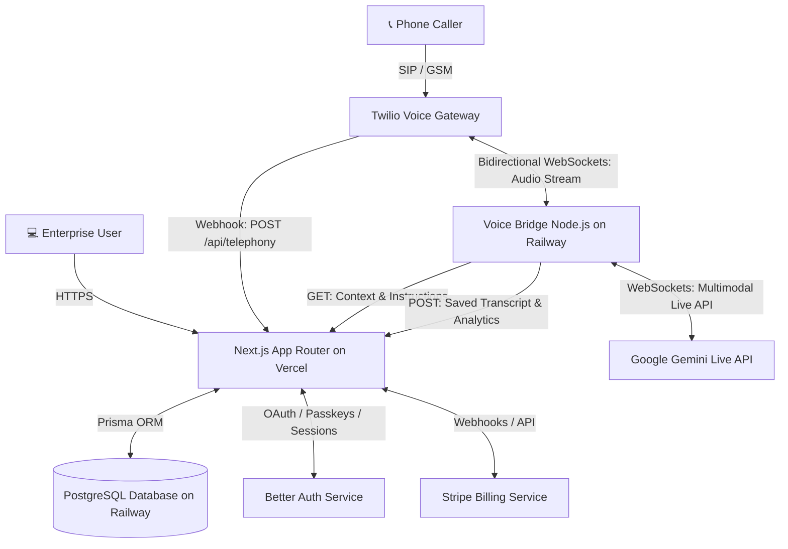
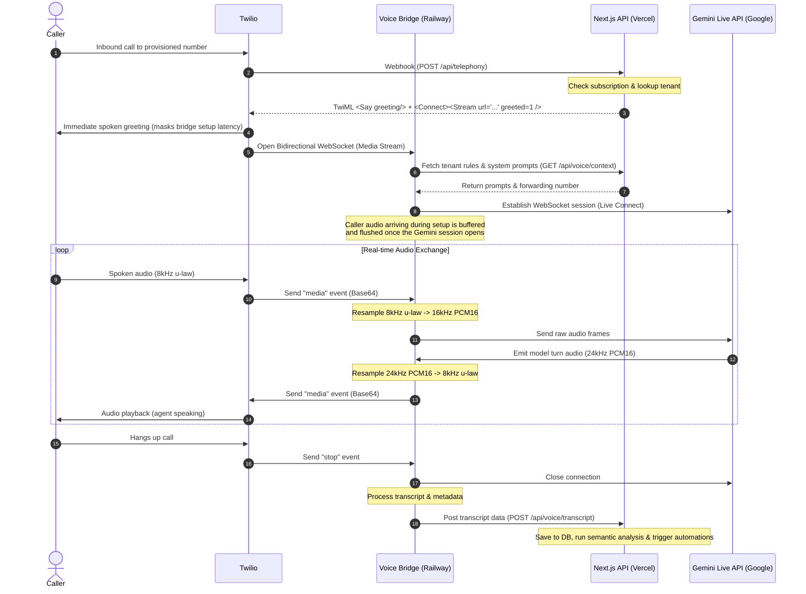
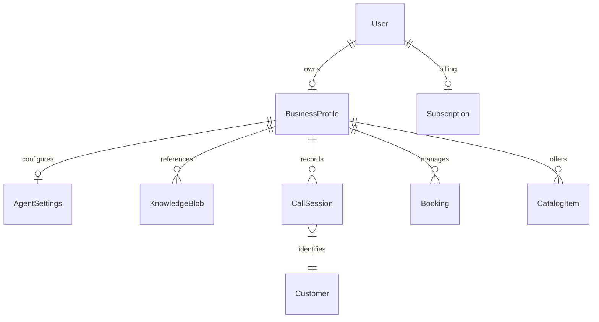

# AI Receptionist — Voice Agent Technical Architecture

This document provides a technical overview of **AI Receptionist**, an automated call answering platform developed by PPE-AI. It details the system architecture, real-time voice streaming pipeline, AI model integrations, and cloud infrastructure layout.

---

## 1. System Architecture Overview

AI Receptionist uses a hybrid serverless and stateful container architecture to deliver low-latency real-time voice calls, structured transaction extraction, and a tenant management dashboard.

### Infrastructure & Services Stack
*   **Next.js (App Router, React 19, TS)**: Deployed on **Vercel**. Serves the enterprise web application, administrative API endpoints, and handles stateless webhook processing.
*   **Voice Bridge (Node.js & WebSockets)**: Deployed on **Railway** (persistent container). Bridges real-time audio streams between Twilio and Gemini's WebSocket API. Vercel's serverless environment cannot run persistent WebSockets, necessitating this dedicated, stateful bridge.
*   **PostgreSQL**: Hosted on **Railway**, managed via **Prisma ORM**. Stores tenant profiles, agent configurations, call transcripts, bookings, and billing details.
*   **Twilio**: Provides telephony routing, phone numbers, call recording, and Bidirectional Media Streams.
*   **Google Gemini API**: Powers live real-time conversations (audio modalities), fallback Text-to-Speech (TTS), and structured analytical evaluations.
*   **Better Auth**: Handles passwordless authentication, passkeys, and multi-tenant session management.
*   **Stripe**: Processes subscription billing, payment plans, and usage limits.

---

## 2. Real-Time Voice Streaming Pipeline

The primary conversation flow uses low-latency bidirectional streaming via WebSockets. 

### Audio Payload Conversion Details ([audio.mjs](file:///Users/rahatayaz/Desktop/AI-Receptionist/scripts/audio.mjs))
Because Twilio and Gemini use different codecs and sampling rates, the Voice Bridge performs real-time audio transcoding in memory without third-party dependencies:
*   **Inbound Conversion**:
    1.  Receives 8kHz $\mu$-law (G.711) audio payload from Twilio.
    2.  Converts $\mu$-law samples to 16-bit linear PCM (`mulawBufToPcm16`).
    3.  Resamples the linear PCM from 8,000Hz up to 16,000Hz via linear interpolation.
    4.  Sends the resulting PCM16 frames to Gemini.
*   **Outbound Conversion**:
    1.  Receives 24kHz PCM16 audio frames from Gemini's Live response modality.
    2.  Resamples the linear PCM down from 24,000Hz to 8,000Hz.
    3.  Encodes 16-bit PCM samples back into 8-bit $\mu$-law (`pcm16ToMulawBuf`).
    4.  Sends Base64-encoded audio packets to Twilio for transmission.

---

## 3. Fallback Turn-Based Pipeline

If the real-time WebSocket bridge is unconfigured (no `PUBLIC_WSS_URL` env variable), the system falls back to a turn-based execution utilizing Twilio `<Gather>` and Gemini text-to-speech.

1.  **Greeting**: The caller connects. Next.js returns a TwiML payload that says a welcome message (using synthesized voice) and wraps the next action in a `<Gather input="speech">` block.
2.  **Speech Webhook**: When the user speaks, Twilio transcribes the speech and posts the result back to `POST /api/telephony` under the `SpeechResult` parameter.
3.  **LLM Text Generation**: The backend calls `generateReply()` to calculate the text response, taking the full context history into account.
4.  **TwiML Loop**: The backend responds to Twilio with a new `<Say>` tag followed by another `<Gather>` tag, keeping the dialogue going.

---

## 4. AI & LLM Core Services ([gemini.ts](file:///Users/rahatayaz/Desktop/AI-Receptionist/src/lib/gemini.ts))

AI Receptionist leverages Google Gemini models for real-time speech, intent parsing, semantic synthesis, and knowledge extraction.

### Latency Controls
*   **Instant TwiML greeting**: The webhook speaks the (personalized) greeting immediately via TwiML before handing off to the stream, so the caller never waits on bridge/Gemini setup; the bridge is told via a `greeted=1` stream parameter not to greet again.
*   **Pre-session audio buffering**: The bridge buffers up to ~10s of caller audio while the Gemini Live session is connecting and flushes it on open, so the caller's first words are never dropped.
*   **VAD tuning**: The Live session uses `END_SENSITIVITY_HIGH` with a 600ms silence window so the agent replies sooner after the caller stops speaking.
*   **Non-blocking recording start**: Call-recording REST calls are fire-and-forget so they never delay TwiML responses.
*   **Fallback thinking disabled**: The turn-based fallback (`generateReply`) runs `gemini-2.5-flash` with `thinkingBudget: 0` and a compact system prompt (rule matrix minified, knowledge blobs capped at 8k chars) to minimise per-turn latency.

### Selected Models
*   **`gemini-2.5-flash-native-audio-latest`**: Drives the Live WebSocket bridge. Native audio input/output minimises speech-to-text latency.
*   **`gemini-3.1-flash-tts-preview`**: Performs fallback text-to-speech audio synthesis (WAV conversion).
*   **`gemini-2.5-flash`**: Powering structured post-call semantic analysis and rule-matrix distillation.

### Intent Analysis & Post-Call Processing ([route.ts](file:///Users/rahatayaz/Desktop/AI-Receptionist/src/app/api/voice/transcript/route.ts))
At the conclusion of each call, the Voice Bridge uploads the full transcript to `POST /api/voice/transcript`. The backend then invokes Gemini using a structured JSON schema (`ANALYSIS_SCHEMA`) to extract:
1.  **Call Summary**: A concise 2-3 sentence overview.
2.  **Classification**: Category (`SALES`, `GENERAL_INFO`, `ISSUE`, `URGENT`, `SPAM`, `UNCLASSIFIED`), Sentiment (`POSITIVE`, `NEUTRAL`, etc.), and Spam detection flags.
3.  **Booking Intent**: Extracted transaction intents:
    *   `CREATE_BOOKING`: Automatically schedules a booking (order or appointment) matching catalog items.
    *   `MODIFY_BOOKING`: Reschedules or updates existing records using resolved reference numbers.

---

## 5. Database Schema Key Concepts ([schema.prisma](file:///Users/rahatayaz/Desktop/AI-Receptionist/prisma/schema.prisma))

*   **`User` & `Session` / `Account`**: Managed by Better Auth; supports OAuth providers and Passkeys.
*   **`BusinessProfile`**: The root tenant model. Stores business context, province taxes, forwarding numbers, and the JSON-encoded `ruleMatrix`.
*   **`AgentSettings`**: Dictates the receptionist name, vocal speed, tone settings, and call recording configurations.
*   **`KnowledgeBlob`**: Stores unstructured tenant data (e.g. scraped websites, PDFs, manuals) injected into Gemini prompts to act as a localized knowledge base.
*   **`CallSession`**: Captures call records, duration, final transcripts, categories, sentiment, spam assessments, and extracted JSON intent fields.
*   **`Booking`**: Stores auto-created orders and appointments containing structured line items.
